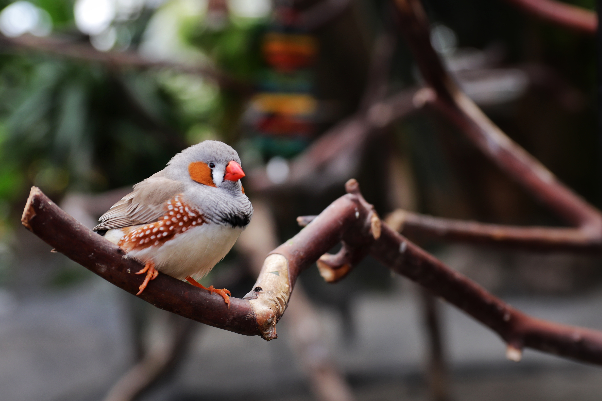

# Finch Collector Lab - Part 1

## Intro

Today in the Django URLs, Views, and Templates lesson, you created a minimal but functional application that renders an index page that dynamically displays a hardcoded list of Cat objects.

In this lab, you’ll do the same, except you’ll create and use a data resource of your choosing.

We have chosen to collect Finches in this example!

Similar to what we did in the lesson, you’ll start by creating a finchcollector project.

FYI, future lessons will expand upon the catcollector project, and the labs will expand upon the finchcollector project!

The final version of finchcollector (parts 1 thru 5 combined) will be a deliverable, so do each part and don’t fall behind.

## Project Setup

1. Create the database

    createdb finchcollector

2. Start the project

    django-admin startproject finchcollector

3. Change into the finchcollector directory and open the project in VScode

    cd finchcollector
    code .

4. Create the app

    python3 manage.py startapp main_app
    Note: You’ll now find a main_app folder within the top-level project folder.

5. Add main_app to the list of INSTALLED_APPS in settings.py:

INSTALLED_APPS = [
	'main_app',
	'django.contrib.admin',
	'django.contrib.auth',
	'django.contrib.contenttypes',
	'django.contrib.sessions',
	'django.contrib.messages',
	'django.contrib.staticfiles',
]

6. Check that your project starts up

    python3 manage.py runserver

7. Connecting to the Database

Earlier we created a dedicated finchcollector PostgreSQL database.

A Django project’s configuration lives in settings.py. Let’s update it to use our finchcollector database:

DATABASES = {
    'default': {
        'ENGINE': 'django.db.backends.postgresql',
        'NAME': 'finchcollector',
    }
}

8. Apply the pending migrations

    python3 manage.py migrate
    You should now be setup and ready to go!

## Exercises

Following the steps we took in the Django URLs, Views, and Templates lesson, complete the following exercises:

1. Simulate finch data using a list of finch dictionaries in views.py.

2. Implement the following User Stories:

    - AAU, I want to be able to navigate to separate pages for About and All Finches using a navbar

    - AAU, when I visit the About page, I want to view some details about the finchcollector application.

    - AAU, when I visit the All Finches page, I want to view a list of all finches (index view) that displays each of the attributes of a finch.

## Bonus

1. Customize your application using CSS, or even a third party CSS library! Here are a few links to some great ones below:

    - Materialize CSS
    - Bootstrap
    - Foundation
    - Bulma

## Deliverable?

The final version of finchcollector (parts 1 thru 5 combined) will be a deliverable, so don’t fall behind.

Please create a repo named finchcollector and commit your code.

After all 5 parts are completed, please submit the link to your repo as directed.

SEIR-Course-Materials

# Finch Collector Lab - Part 2

## Intro

Today in the Intro to Django Models lesson, you replaced the existing Cat class with a proper Cat model, as well as implemented ‘Index’ and ‘Detail’ functionality for the Cat data resource.

In this lab, you’ll do the same, except for a data resource of your choosing.

We have chosen to collect Finches in this example!

FYI, future lessons will expand upon the catcollector project, and the labs will expand upon the finchcollector project!

The final version of finchcollector (parts 1 thru 5 combined) will be a deliverable, so do each part and don’t fall behind.

## Exercises

Following the steps we took in the Intro to Django Models lesson, complete the following exercises:

1. Create a Finch model with at least three attributes.

2. Using the Python Interactive Shell (python3 manage.py shell), create some finches in your database to be rendered on the page.

    Don’t forget to import your Finch model

3. Register the Finch model with the admin portal in admin.py.

4. Implement the following User Stories:

    - AAU, when I visit the All Finches page, I want to view a list of all finches from the database (index view) that displays each of the attributes of a finch.

    - AAU, when I click on a finch card on the index page, I want to be taken to a details page where I can see all attributes of the finch.

## Deliverable?

The final version of finchcollector (parts 1 thru 5 combined) will be a deliverable, so do each part and don’t fall behind.

Please create a repo named finchcollector and commit your code.

After all 5 parts are completed, please submit the link to your repo as directed.

SEIR-Course-Materials

# Finch Collector Lab - Part 3

## Intro

Today in the Django Class Based Views lesson, you learned about all of the wonders of Class Based Views, and used them to implement ‘Create’, ‘Update’, and ‘Delete’ functionality for the Cat data resource.

In this lab, you’ll do the same, except for data resource, e.g., finches.

FYI, future lessons will expand upon the catcollector project, and the labs will expand upon the finchcollector project!

The final version of finchcollector (parts 1 thru 5 combined) will be a deliverable, so do each part and don’t fall behind.

## Exercises

Following the steps we took in the Django Class Based Views lesson, complete the following exercises:

1. Using Class Based Views, implement the following User Stories:

    - AAU, I want to be able to add a Finch to my list of Finches

    - AAU, I want to be able to add edit the attributes of a Finch

    - AAU, I want to be able to remove a Finch from my list of Finches

## Deliverable?

The final version of finchcollector (parts 1 thru 5 combined) will be a deliverable, so do each part and don’t fall behind.

Please create a repo named finchcollector and commit your code.

After all 5 parts are completed, please submit the link to your repo as directed.

# Finch Collector Lab - Part 4

## Intro

Today in the Django - One:Many Relationships lesson, you learned how to add another model that demonstrates working with one-to-many relationships in Django.

In this lab, you’ll do the same, except for a data resource of your choosing.

We have chosen to collect Finches in this example!

FYI, future lessons will expand upon the catcollector project, and the labs will expand upon the finchcollector project!

The final version of finchcollector (parts 1 thru 5 combined) will be a deliverable, so do each part and don’t fall behind.

## Exercises

Following the steps we took in the Django - One:Many Relationships lesson, complete the following exercises:

1. Create another model that will have a One:Many relationship with your main data entity.

2. Implement similar functionality to the Feeding model in catcollector, including the following User Stories:

    - AAU, when I visit the detail page for a finch, I want to see a list of feedings for that finch.

    - AAU, when I visit the detail page for a finch, I want to be able to add a feeding for a finch.

## Bonus

1. Adding a Custom Method to Check the Feeding Status:

    - AAU, when I visit the detail page for a finch, I want to see a message displaying a status of ‘hungry’ or ‘fed’.

## Deliverable?

The final version of finchcollector (parts 1 thru 5 combined) will be a deliverable, so do each part and don’t fall behind.

After all 5 parts are completed, please submit the link to your repo as directed.

SEIR-Course-Materials

# Finch Collector Lab - Part 5

## Intro

Today in the Django - Many:Many Relationships lesson, you learned how to add another model that demonstrates working with many-to-many relationships in Django.

In this lab, you’ll do the same, except for a data resource of your choosing.

We have chosen to collect Finches in this example!

FYI, future lessons will expand upon the catcollector project, and the labs will expand upon the finchcollector project!

The final version of finchcollector (parts 1 thru 5 combined) will be a deliverable, so do each part and don’t fall behind.

## Exercises

Following the steps we took in the Django - Many:Many Relationships lesson, complete the following exercises:

1. Create another model that will have a Many:Many relationship with your main data entity.

    - Don’t forget to add a ManyToManyField on one of the Models.

2. Add at least the ability to Create the new model. Refer to how Cat Collector used CBV’s to implement full-CRUD with very little code in views.py. Don’t forget to add the additional routes in urls.py and the necessary templates.

3. Implement similar functionality to the Toy model in catcollector, including the following User Stories:

    - AAU, I want to see a list displaying all of the toys in the database. (Step 2 above)

    - AAU, I want to be able to add a Toy to list of Toys. (Step 2 above)

    - AAU, when I visit the detail page for a finch, I want to see a list of toys belonging to the finch, and also any available toys that I can add to the finch.

## Deliverable?

This is the final version of finchcollector (parts 1 thru 5 combined) - please submit the link to your repo as directed.